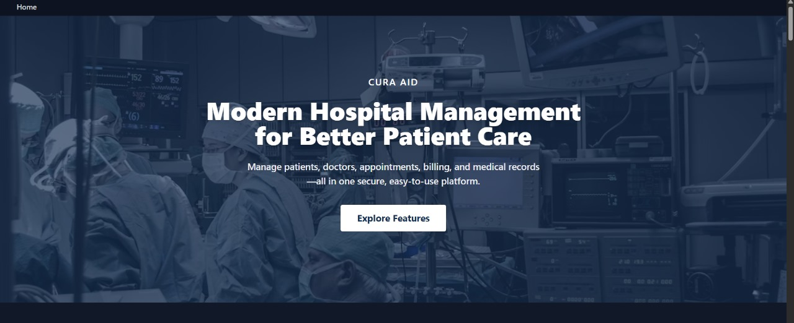

# Cura Aid - Advanced Medical Platform



## Overview
Cura Aid is a modern, highly customizable medical platform built with React, TypeScript, Zustand, and Tailwind CSS. It features a robust multi-theme system, multi-locale support, responsive design, and seamless API integration, making it suitable for a wide range of healthcare and wellness applications.

## Key Features
- **Advanced Theme System:** Switch between multiple medical specialty themes (e.g., Organ Transplant, Cosmetic Surgery, Default) with unique color schemes, typography, and layouts. Themes persist across sessions and can be previewed live.
- **Responsive Layout:** Optimized for all screen sizes and devices.
- **Dark/Light Mode:** Easily toggle between light and dark themes.
- **Multi-Locale Support:** Easily add and manage multiple languages with RTL support.
- **API Ready:** Simple integration with any RESTful API.
- **Component-Based Architecture:** Reusable, well-typed React components for rapid development.
- **State Management:** Powered by Zustand for fast, scalable state handling.
- **Modern Tooling:** Built with Vite, Tailwind CSS, and TypeScript for a fast, maintainable codebase.

## Project Structure
```
src/
├── @types/                # TypeScript type definitions
├── assets/                # Static assets (styles, images, maps)
├── components/            # Shared and template components
├── configs/               # App, theme, and endpoint configs
├── constants/             # App-wide constants
├── locales/               # Localization files
├── mock/                  # Mock data and APIs
├── services/              # API service layers
├── store/                 # Zustand stores
├── utils/                 # Utility functions and hooks
├── views/                 # App views and feature pages
└── main.tsx               # App entry point
```

## Getting Started
### Prerequisites
- Node.js (v14+)
- npm (v6+)
- Docker (for local subdomain testing)

### Setup
1. **Clone the repository:**
   ```bash
   git clone https://github.com/MILI-5/cura-aid.git
   cd cura-aid
   ```
2. **Install dependencies:**
   ```bash
   npm install
   ```
3. **Start the development server:**
   ```bash
   npm run dev
   ```
4. **(Optional) Subdomain Testing with Docker + Caddy:**
   - Use the provided `Caddyfile` and `docker-compose.yml` for local subdomain routing.
   - Start with: `docker-compose up -d`

## Theming System
- Themes are defined in `src/views/Home/themes/` and configured in `src/configs/theme.config.ts`.
- Theme state is managed in `src/store/themeStore.ts` and persisted in localStorage.
- Use the Theme Selector component to preview and switch themes live.
- All theme variables are integrated with Tailwind CSS for dynamic styling.

## Localization
- Add new languages in `src/locales/lang/` and configure in `src/locales/locales.ts`.
- RTL support is built-in for languages like Arabic and Hebrew.

## API Integration
- Use `src/services/ApiService.ts` and `src/services/ApiServiceV2.ts` for RESTful API calls.
- Easily extend or swap API layers as needed.

## Contributing
1. Fork the repository
2. Create a new branch (`git checkout -b feature/your-feature`)
3. Commit your changes (`git commit -am 'Add new feature'`)
4. Push to the branch (`git push origin feature/your-feature`)
5. Open a Pull Request

## License
This project is licensed under the MIT License.

---
For more information, see the codebase and in-code documentation. If you have questions or want to contribute, open an issue or pull request on [GitHub](https://github.com/MILI-5/cura-aid).
